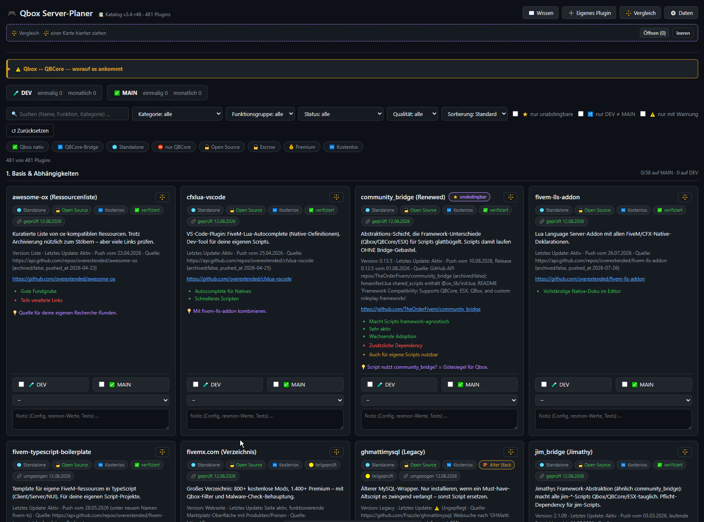
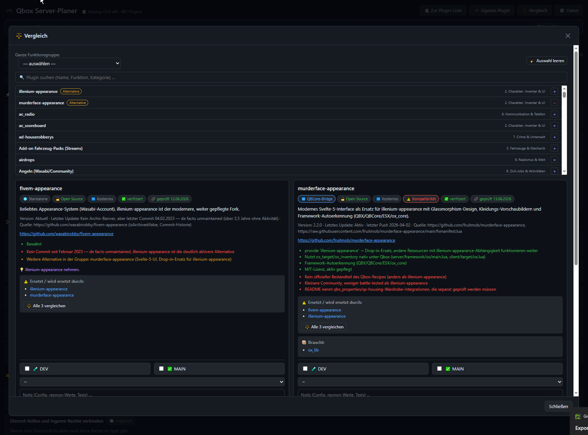
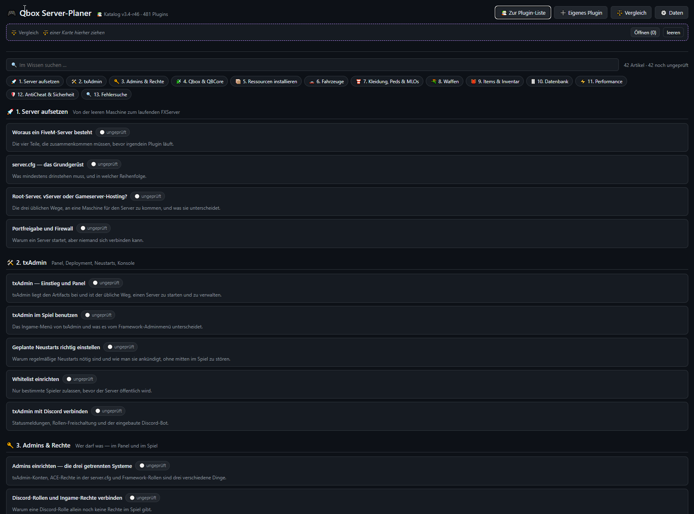
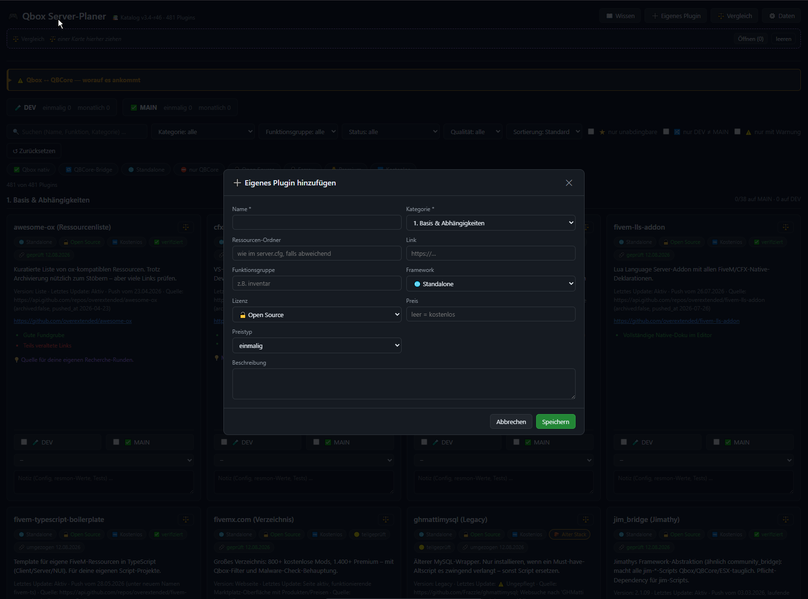

# Qbox Server-Planer

Ein offline nutzbares Planungs-Werkzeug für FiveM-Server auf Basis des **Qbox**-Frameworks.
Ein Katalog mit **500+ recherchierten Plugins** (Stand: v3.4-r50, 524 Einträge), dazu ein
Werkzeug, das dir hilft zu entscheiden, was du auf deinem Server installierst — inklusive
Abhängigkeiten, Konflikten, Alternativen und Warnungen vor kaputter QBCore-Kompatibilität.

Alles läuft als **eine einzige HTML-Datei**, ganz ohne Server, Internetverbindung oder
Installation. Doppelklick, fertig.

<p align="center">
  
  
</p>
<p align="center">
  
  
</p>

---

## Was das Tool kann

**Katalog & Suche**
- 500+ Plugins, kategorisiert in 14 Bereichen (Basis, Fahrzeuge, Wohnen, Staatliche Jobs,
  Crime, Kommunikation, Waffen, Wirtschaft, Admin, MLOs/Assets u. a.)
- Volltextsuche, Filter nach Kategorie, Framework, Preis, Lizenz, Qualität, Funktionsgruppe
- Facetten-Filter statt starrem UND — mehrere Filter kombinieren sich sinnvoll

**Zwei Umgebungen gleichzeitig planen**
- Getrennte Haken für **DEV**- und **MAIN**-Server pro Plugin
- Zeitstempel, wann ein Haken gesetzt wurde, Notizfeld pro Plugin, Prioritäts-Marker

**Beziehungen zwischen Plugins — das Kernstück**
- ⚠️ **Ersetzt**: konkurrierende Plugins für dieselbe Funktion (z. B. mehrere Tankstellen- oder
  Garagen-Systeme) werden als Gruppe erkannt, nur eines sollte installiert werden
- 🔗 **Synergie**: Plugins, die zusammen mehr können, aber auch einzeln funktionieren
- ➕ **Ergänzt**: ein Plugin liefert Zusatzfunktionen zu einem anderen, mit ausformuliertem
  Plus/Minus-Vergleich
- 📦 **Abhängigkeiten**: was vorausgesetzt wird, anklickbar verlinkt, mit Zyklus- und
  Vollständigkeitsprüfung
- 🪦 **Archiviert**: totes oder abgelöstes Repo, mit Nachfolger-Verweis, wenn bekannt

**Kompatibilitäts-Warnungen statt Bauchgefühl**
- Jedes Plugin trägt einen Beleggrad: `bestaetigt` (im Code/README nachgewiesen) oder
  `vermutung` (Indiz, aber nicht zweifelsfrei belegt) — nie geraten
- Laufender Prüfbericht mit Ein-Klick-Behebung für offene Warnungen
- Alt-Stack-Hinweise für Plugins mit harter `qb-inventory`/`qb-target`-Abhängigkeit, die unter
  reinem Qbox brechen können

**Vergleich**
- Beliebig viele Plugins nebeneinander vergleichen (Klick oder Drag & Drop in die Vergleichsleiste)
- Funktionsgruppen-Filter, um konkurrierende Alternativen direkt gegenüberzustellen

**Wissens-Datenbank**
- Eigener Reiter mit 42 Hintergrund-Artikeln zu 13 Themen (txAdmin, Server aufsetzen,
  Admins & Rechte, AntiCheat u. a.)

**Backup & Export**
- Dein Fortschritt (Haken, Notizen, Prioritäten) liegt lokal im Browser (`localStorage`),
  niemals der Katalog selbst — Export/Import als Backup-Datei mit Umbenennen-Dialog

---

## Schnellstart

1. Aktuellstes Release unter [**Releases**](../../releases) herunterladen
   (`qbox-planer-vX.X-rXX.html`)
2. Datei per Doppelklick öffnen — läuft im Browser über `file://`, keine Installation, kein
   Internet nötig, keine Daten verlassen deinen Rechner
3. Filtern, Haken setzen, Notizen schreiben — der Fortschritt bleibt beim nächsten Öffnen erhalten

---

## Open Source — nimm dir, was du brauchst

Das komplette Projekt steht unter der **MIT-Lizenz** (siehe [LICENSE](LICENSE)). Du darfst:

- die fertige `dist/qbox-planer.html` einfach benutzen
- den kompletten Katalog (`data/catalog/*.json`) für eigene Zwecke weiterverwenden oder
  in ein eigenes Tool einbauen
- den Quellcode (`src/`, `scripts/`) forken, verändern, selbst weiterbauen

Es sind keine privaten Daten, Zugangsdaten, IPs oder Server-Details irgendeiner Art im Repo
enthalten — alles hier ist recherchiertes Wissen über öffentlich verfügbare FiveM/Qbox-Plugins.

---

## Selbst weiter recherchieren oder das Tool erweitern

Das gesamte Projekt ist so gebaut, dass man es **nicht per Hand bedient**, sondern mit einer
KI-Coding-Oberfläche — z. B. **[Claude Code](https://claude.com/product/claude-code)**, aber
auch andere Werkzeuge mit Datei- und Terminalzugriff funktionieren. So ist der komplette
Katalog entstanden: durch Zuruf auf Deutsch, nicht durch manuell eingetippte Befehle.

Du musst dafür **keine `npm`-Befehle kennen oder selbst eintippen.** Öffne den Repo-Ordner in
Claude Code (oder einem vergleichbaren Werkzeug) und schreib einfach in normaler Sprache, was
du willst — der Agent liest beim Start automatisch [`CLAUDE.md`](CLAUDE.md) (dort stehen alle
Architektur- und Recherche-Regeln des Projekts) und weiß selbst, welche Skripte er wann
aufruft, welche Dateien er dafür braucht und wie ein sauberer Katalogeintrag aussieht.

### Was du dem Agenten sagen kannst — Beispiele

**Neue Plugins recherchieren**
> „Mach eine neue Recherche-Runde zum Thema Angeln und Jagen, so wie die letzten Runden auch."
> „Durchsuche GitHub nach neuen Qbox-Plugins rund um Bootsvermietung und häng sie an den
> Katalog an."

**Bestehende Einträge nachpflegen**
> „Prüf alle Plugins in der Kategorie Crime nach, deren letzte Prüfung älter als 3 Monate ist."
> „Der Link zu `xyz-script` ist tot, such nach dem neuen Repo und korrigier den Eintrag."
> „`ox_fuel` ist mittlerweile archiviert — trag das ein und schau, ob es einen Nachfolger gibt."

**Wissens-Datenbank ausbauen**
> „Füge einen neuen Wissens-Artikel zum Thema Server-Backups hinzu, ungeprüft ist okay."
> „Verifiziere alle Wissens-Artikel in der Kategorie txAdmin gegen echte Quellen und markiere
> sie entsprechend."

**Das Tool selbst verändern — Basis, Schema, Oberfläche, wirklich alles**
> „Füge dem Katalog-Schema ein neues Feld für einen Discord-Server-Link pro Plugin hinzu und
> zeig es in der Karte an."
> „Ich will die Plugins zusätzlich nach Autor filtern können — bau das ein."
> „Die Vergleichsleiste soll oben rechts statt oben links sein, und das Farbschema soll heller
> werden."
> „Bau eine neue Kategorie 'Eigene Server-Skripte' ein, in die ich private Einträge legen kann,
> die nicht im öffentlichen Katalog landen."
> „Exportiere meinen Fortschritt zusätzlich als CSV-Datei, nicht nur als Backup-JSON."

Kurz gesagt: **Es gibt keinen Teil des Projekts, den du nicht per Zuruf ändern kannst** —
Kategorien, Schema, Recherche-Methodik, Oberfläche, Datenstruktur, alles. Der Agent liest
dafür bei Bedarf `docs/DECISIONS.md` (was schon entschieden wurde und warum), `docs/FEATURES.md`
(was das Tool aktuell kann) und `docs/RECHERCHE.md` (wie ein Katalogeintrag entsteht) und
erklärt dir vorher, wenn eine Änderung mit einer bestehenden Entscheidung kollidiert.

Die einzige feste Regel, die der Agent selbst durchsetzt: **nichts erfinden.** Was sich nicht
aus README, Quellcode oder Repo-Metadaten belegen lässt, bekommt `qualitaet: "ungeprueft"`
statt eines geratenen Werts — das gilt für jede Recherche, egal welches Thema du vorgibst.

### Projektstruktur

```
data/catalog/    Plugin-Katalog, aufgeteilt in Recherche-Runden (reine Daten, kein Code)
data/wissen/     Wissens-Datenbank-Artikel
schema/          JSON-Schema, gegen das der Katalog validiert wird
src/             App-Code (wird zu dist/qbox-planer.html gebaut)
scripts/         Node-Skripte, die der Agent selbst aufruft (validate, build, discover,
                 prefetch, stats, find, linkcheck) — für dich als Nutzer nicht relevant
docs/            Projektdokumentation (Fortschritt, Entscheidungen, Recherche-Methodik)
```

**Wichtigste Regel im Hintergrund:** Daten (`data/`) und App (`src/`) sind strikt getrennt —
ein neues Plugin im Katalog erfordert nie eine Code-Änderung. Der Agent hält sich automatisch
daran, du musst dir darüber keine Gedanken machen.

---

## Haftungsausschluss

Der Katalog ist eine Fleißarbeit, keine Garantie. Kompatibilitätsangaben mit dem Vermerk
„vermutung" sind Indizien, keine Zusicherung. Vor dem produktiven Einsatz eines Plugins
immer selbst die verlinkte Quelle prüfen — Repos verändern sich, werden verkauft, archiviert
oder umbenannt.
